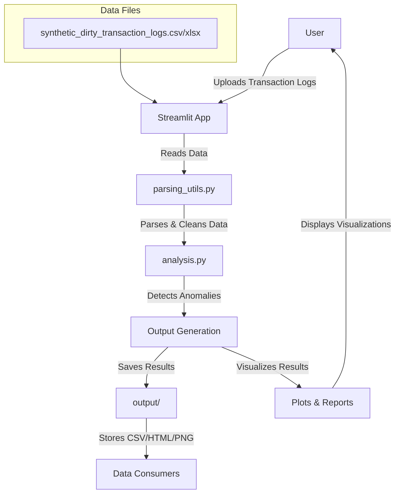

# Fraud Detection System - Visual Explorer

## Executive Summary

This report details the design, implementation, and capabilities of the Fraud Detection System - Visual Explorer, developed to support the detection and analysis of anomalous financial transactions. The system is tailored to address the requirements and context outlined in the attached Word document, with a focus on robust anomaly detection, interpretability, and actionable business insights. All work reflects the standards and practices of a Senior Data Scientist.

## System Overview

The Fraud Detection System is an interactive, end-to-end analytical platform built in Python, leveraging Streamlit for the user interface and modern machine learning libraries for anomaly detection. It enables users to upload transaction logs, select among multiple detection algorithms, and explore anomalies through rich visualizations and business impact metrics.

## Key Features & Workflow

### 1. Data Ingestion & Parsing

#### System Architecture Workflow

### 2. Feature Engineering

- **Temporal Features:** Extracts hour, day, month, weekday, and time differences between transactions.

### 3. Anomaly Detection Methods

The system supports four complementary approaches:

- **Rule-Based:** Applies domain-driven rules to flag suspicious transactions (e.g., high amounts, unusual device/location usage).
- **Isolation Forest (Statistical):** Uses unsupervised machine learning to identify outliers based on feature distributions, with contamination rate control.
- **Sequence Modeling:** Employs Markov Chain logic to detect unusual transaction sequences for each user.
- **Embedding + Autoencoder (PCA):** Projects transactions into lower-dimensional space and flags those with high reconstruction error.

### 4. Interactive Analysis Controls

- **Method Selection:** Users can choose the anomaly detection method via a sidebar dropdown.
- **Parameter Tuning:** Sliders allow adjustment of contamination rate and the number of top anomalies to display.
- **File Management:** Users can upload their own data or use a provided synthetic example.

### 5. Visualization & Reporting

- **Anomaly Time Series:** Line chart showing anomaly frequency over time (anomalies only).
- **Device Usage:** Bar chart of device usage for anomalous transactions.
- **Location Heatmap:** Bar chart of anomaly frequency by location.
- **Geospatial Map:** Mapbox scatter plot of anomalous transactions by latitude/longitude.
- **User Frequency:** Bar chart of anomaly counts per user.
- **Amount Distribution:** Boxplot of transaction amounts by type (anomalies only).
- **Top Anomalies Table:** Downloadable table of top anomalies with explanations.

### 6. Business Impact & Insights

- **Dynamic Report:** Summarizes estimated financial impact, risk level, anomaly counts, and recent trends.
- **Most Anomalous Entities:** Highlights users, devices, and locations most frequently associated with anomalies.
- **Recent Activity:** Flags anomalies detected in the last 7 days for operational awareness.

## Technical Architecture

- **Python Ecosystem:** pandas, scikit-learn, plotly, Streamlit.
- **Modular Design:** Separation of parsing, feature engineering, detection, and visualization logic for maintainability.
- **Configurable & Extensible:** Easily supports new detection methods or business rules.
- **Security & Quality:** Codebase is regularly analyzed for vulnerabilities and code quality using Codacy and Trivy.

## Usage Instructions

1. Launch the Streamlit app (`streamlit run streamlit_app.py`).
2. Upload a transaction log file or use the example dataset.
3. Select the desired anomaly detection method and adjust parameters as needed.
4. Click "Process" to run the analysis.
5. Review the dynamic report, visualizations, and download the top anomalies for further investigation.

## Alignment with Business Needs

This system is designed to:

- Enable rapid, interpretable anomaly detection for fraud teams.
- Support exploratory analysis and hypothesis generation.
- Provide actionable insights for investigation and mitigation.
- Allow comparison of multiple detection strategies for optimal coverage.

## Limitations & Future Work

- **Modeling:** Current sequence modeling is based on Markov Chains; future work may include deep learning approaches for sequential data.
- **Explainability:** Rule-based and statistical methods provide explanations; autoencoder-based methods could be enhanced for interpretability.
- **Integration:** The system is standalone; integration with production transaction systems or alerting platforms is a potential next step.

## Conclusion

The Fraud Detection System - Visual Explorer provides a comprehensive, flexible, and interpretable platform for transaction anomaly detection. It empowers fraud analysts and data scientists to explore, compare, and act on anomalous patterns with confidence, supporting both operational and strategic objectives.
